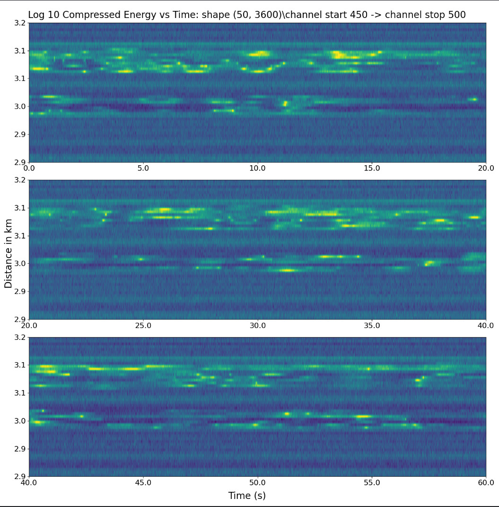

## program: extractRawTimeSeries.py

# select database h5py file

# for a single plot of a single channel:
if plotOne == True:
select channel: 
    desiredChannel = 491
select start time and stop time for the timeseries plot
    time_start = 10  # desired times in seconds for plots
    time_stop = 20
# for plots of multiple channels set start channel and end channel
#  if plotOne == False  select the channels for istart to istop and plot all these
    istart = 480   # these are channel numbers in the fiber dataset
    istop  = 496
    nrows = 4
    ncols = 4
Note how many plots you are creating and make sure nrows * ncols is at least this large.

## Single plot example:

## Multiple plot example:

## program: displayCompressedEnergy.py

#Read fiber data and extract desired channels.
#Compress the data in channel number to the selected number of bins in the y-axis.

#Setup a bunch of parameters:

filename = "/home/bigbox/PycharmProjects/DAS_Files/OOI_DAS_2024/ValFiles/data/decimator_2024-11-06_23.43.00_UTC_023887.h5"
loadFrom_h5 = True   # False dignifies use pickled binary file of previous selection

start_time = "2024-10-09T19:09:00.000714+00:00"
v_sound = 1490

n_Xslices = 50 #10    # sum the square of the filtered timeseries**2 into this number of bins (distance axis)

# these parameters determine how many channel's timeseries are extracted from the h5py database
channel_start =  450# 0# 450#1875
channel_stop  = 500# #500 # 2200   # this can't be larger than the second axis of the input array which is n_channels!!!!

deltaTslices = 60  # sum the samples axis into bins of this width in seconds
# Bandpass filter parameters
lowcut = 500
highcut = 960
order = 4  # Filter order
#  plot controls
plotLogs = True  # If True, display log10 of filtered, compressed stress in heatmap
NstdMax = 4 # in heatmap, 'remove' (set energy = 1) any points greater than NstdMax * std above mean
nrows = 3   # multiple rows should spread the time over subtime intervals of the dataset's time axis max

## Sample plot

