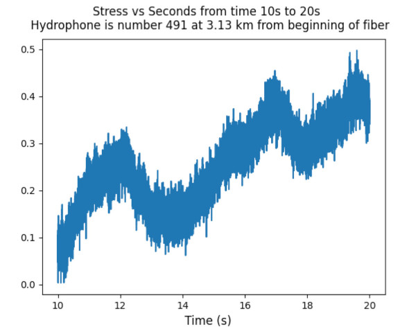
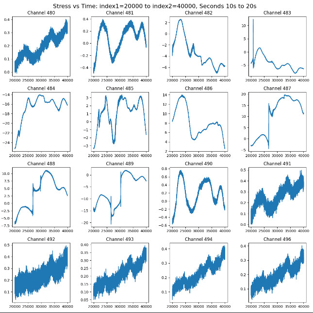

## program: extractRawTimeSeries.py

# select database h5py file

# for a single plot of a single channel:
if plotOne == True:
select channel: 
    desiredChannel = 491
select start time and stop time for the timeseries plot
    time_start = 10  # desired times in seconds for plots
    time_stop = 20
# for plots of multiple channels set start channel and end channel
#  if plotOne == False  select the channels for istart to istop and plot all these
    istart = 480   # these are channel numbers in the fiber dataset
    istop  = 496
    nrows = 4
    ncols = 4
Note how many plots you are creating and make sure nrows * ncols is at least this large.

## Single plot example:

## Multiple plot example:

## program: displayCompressedEnergy.py

